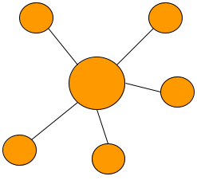
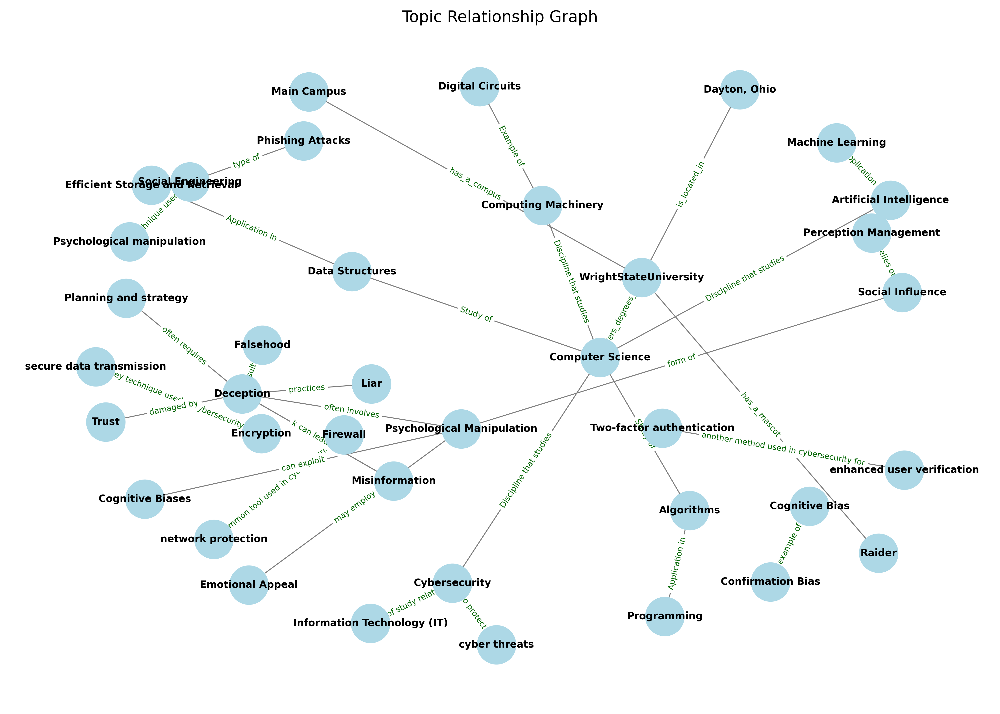
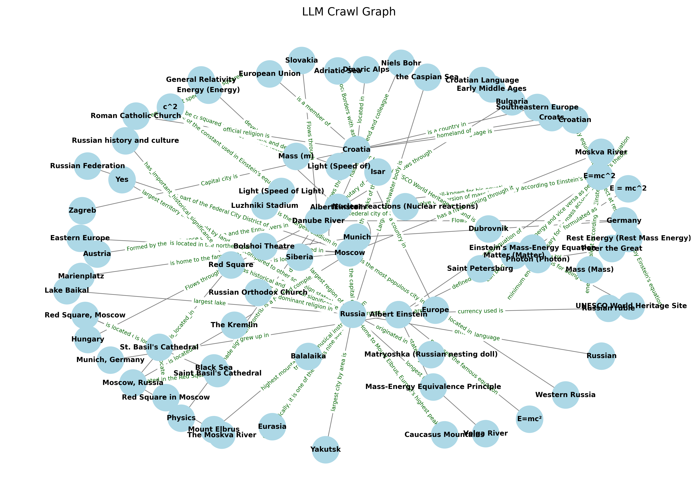

<p align="center">
  <a href="https://github.com/reesehatfield/karma">
    
  </a>
</p>

<h3 align="center"><strong>KARMA</strong></h3>

<p align="center">
    Knowledge Association and Reasoning Mapping Agent
  <br>
</p>

## What is KARMA?
KARMA is a large language model (LLM) internal knowledge-based fact crawler. KARMA is a dynamic system that can crawl semantically related concepts in an LLM. Facts are checked verified against existing an knowledge base, using the WikiData API. KARMA will walk through facts about a given topic, dynamically selecting new facts based on the LLMs perceived relationship to one another.

## Examples
<p align="center">
  <a href="https://github.com/reesehatfield/karma">
    
  </a>
</p>
<p align="center">
    Query for Wright State University
  <br>
</p>
<!-------------------->
<p align="center">
  <a href="https://github.com/reesehatfield/karma">
    
  </a>
</p>
<p align="center">
    Query for Albert Einstein
  <br>
</p>


## Usage
To use KARMA, just run the shell script with the topic as the first argument (do not use spaces)

```bash
# crawl LLM knowledge related to Albert Einstein
./run.sh "AlbertEinstein"
# see output image in ./visualization/graph_output.png
# bat visualization/graph_output.png
```

## Prerequisites


| Requirement | Purpose                          |
|:------------|:---------------------------------|
| Rust        | Implementation language          |
| Cargo       | Dependency and build manager     |
| Python      | Visualization language           |
| Pip         | Visualization dependency manager |
| Ollama      | LLM backend                      |

```bash
# Install mistral with Ollama
ollama pull mistral
```


## Documentation
This serves as a table of contents for much of the information related to KARMA.

[Knowledge Crawling](./docs/Crawling.md)
- [How does KARMA crawl knowledge?](./docs/Crawling.md#how-does-karma-crawl-knowledge)

[Future Work](./docs/FutureWork.md)
- [Configurable Models](./docs/FutureWork.md#configurable-models)
- [Predicate Verification](./docs/FutureWork.md#predicate-verification)
- [WikiData Global Verification vs Retrieved Verification](./docs/FutureWork.md#wikidata-global-verification-vs-retrieved-verification)
- [Usability](./docs/FutureWork.md#usability)
- [Ranked Predictions](./docs/FutureWork.md#ranked-predictions)
- [Improved Object Verification](./docs/FutureWork.md#improved-object-verification)

[Prompting Methodology](./docs/PromptingMethodology.md)
- [Task Exposition](./docs/PromptingMethodology.md#task-exposition)
- [Definitions](./docs/PromptingMethodology.md#definitions)
- [Assurance of Relevancy](./docs/PromptingMethodology.md#assurance-of-relevancy)
- [Example](./docs/PromptingMethodology.md#example)
- [Generation Request](./docs/PromptingMethodology.md#generation-request)
- [Final Prompt](./docs/PromptingMethodology.md#final-prompt)

[Relevance](./docs/Relevance.md)
- [Knowledge Verification](./docs/Relevance.md#knowledge-verification)
- [Internal Knowledge Crawling](./docs/Relevance.md#internal-knowledge-crawling)

[Models](./docs/SupportedModels.md)
- [Why was Mistral Chosen for KARMA?](./docs/SupportedModels.md#why-was-mistral-chosen-for-karma)
  - [Deepseek](./docs/SupportedModels.md#deepseek)
  - [LlammaThree](./docs/SupportedModels.md#llammathree)
  - [GPT2](./docs/SupportedModels.md#gpt2)
  - [Triplex](./docs/SupportedModels.md#triplex)
